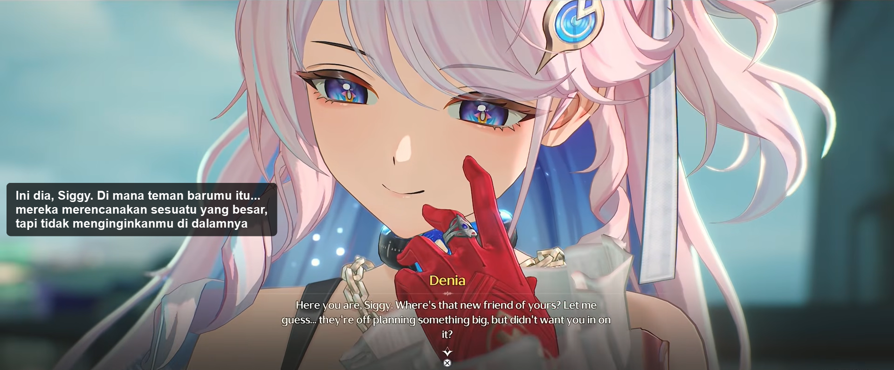
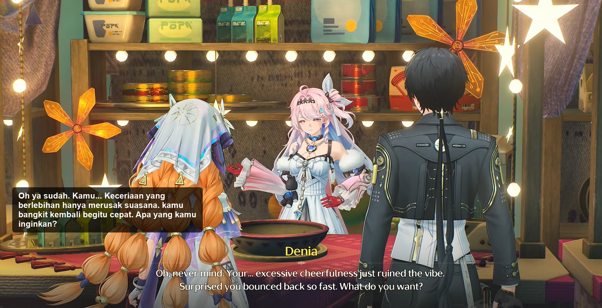
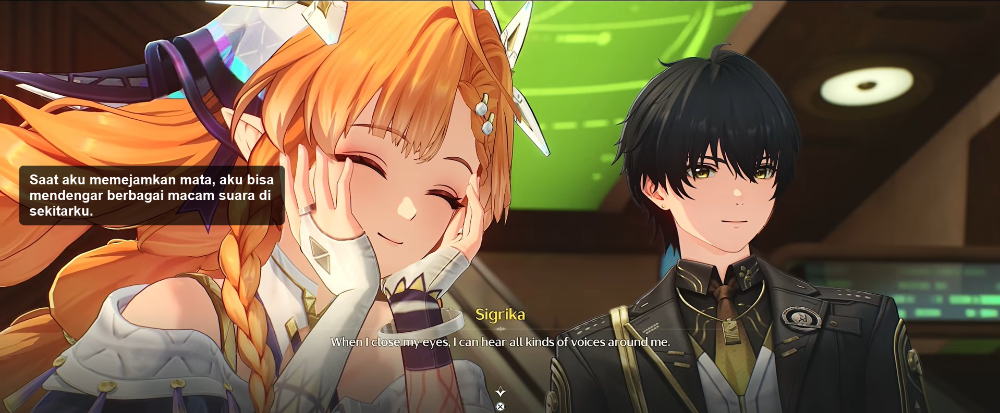

<h1 align="center">Real-Time AI Screen Translator</h1>

A blazing fast, ultra-lightweight real-time screen translation tool built specifically for gamers. This app allows you to draw a box over any portion of your screen (like game dialog boxes, visual novels, or lyrics) and translates the text instantly, overlaying the translation directly on your screen without disrupting your gameplay.

## 📸 Screenshots
<p align="center">
  
  
  
</p>

## ✨ Features
- **Zero-Overhead Capture**: Uses `mss` for lightning-fast, physical-pixel accurate region screen capture.
- **Built-in Windows OCR**: Utilizes the native Windows 10/11 OCR (`winsdk`), meaning NO heavy AI models (like Tesseract binaries or PyTorch) are running on your PC. It's incredibly fast and uses almost zero CPU/RAM.
- **Smart Diffing Engine**: Only translates when the text actually changes, saving bandwidth and preventing API spam.
- **Lightweight Online Translation**: Powered by `deep-translator` routing through free web endpoints, requiring absolutely zero local compute for language processing.
- **Gamer-Friendly UI**: 
  - Sleek, dark-mode Control Panel.
  - Minimizes quietly to the System Tray.
  - Global **`Ctrl+Alt+X`** hotkey to instantly stop translation without ever having to Alt-Tab out of your game.

## 🛡️ Is this safe?
**Yes!** 
- **No Heavy Background AI**: We do not run any local LLMs that hog your GPU, battery, or memory.
- **Native OS APIs**: The text recognition relies entirely on the highly optimized OCR engine already built into your Windows operating system.
- **Open Source**: The code is completely transparent. Feel free to inspect `main.py` and the other scripts to see exactly how your data is handled!

## 🚀 Setup & Development (For Forking)

If you want to fork this project, modify the code, or run it directly from the Python source, follow these steps:

1. **Clone the repository**:
   ```bash
   git clone https://github.com/yourusername/AI-Translation-Realtime.git
   cd AI-Translation-Realtime
   ```

2. **Install Dependencies**:
   ```bash
   pip install -r requirements.txt
   ```
   *(Note: This project requires Windows 10 or 11 due to the `winsdk` dependency).*

3. **Run the App**:
   ```bash
   python main.py
   ```

## 📦 How to Build the Standalone `.exe`

If you want to compile your modified code into a single, highly compressed `.exe` file to share with friends who don't have Python installed, you can use PyInstaller.

1. **Install PyInstaller**:
   ```bash
   pip install pyinstaller
   ```

2. **Run the Optimized Build Command**:
   By default, the PyQt6 UI framework includes massive web and database libraries that we don't need. Run this exact command to aggressively exclude those bulky unused libraries and compress the app into a single executable file:
   
   ```bash
   pyinstaller --onefile --noconsole --icon=icon.png --add-data "icon.png;." --exclude-module PyQt6.QtNetwork --exclude-module PyQt6.QtSql --exclude-module PyQt6.QtTest --exclude-module PyQt6.QtQml --exclude-module PyQt6.QtQuick --exclude-module PyQt6.QtWebSockets -n "RealtimeTranslation_Compact" main.py
   ```

3. **Find your App**:
   Once finished, your new standalone app will be located in the `dist/` folder as `RealtimeTranslation_Compact.exe` (roughly ~73MB). You can drag and drop this single file to anyone!

## 📝 License
MIT License
